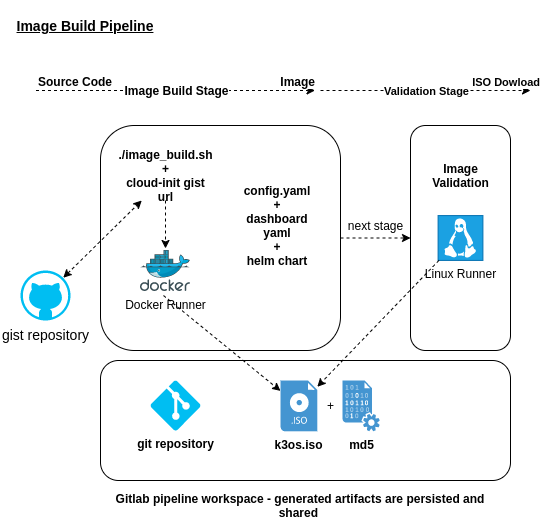

# k3OS
k3OS is a Linux distribution designed to remove as much OS maintenance
as possible in a Kubernetes cluster.  It is specifically designed to only
have what is needed to run [k3s](https://github.com/rancher/k3s). Additionally
the OS is designed to be managed by kubectl once a cluster is bootstrapped.
Nodes only need to join a cluster and then all aspects of the OS can be managed
from Kubernetes. Both k3OS and k3s upgrades are handled by the k3OS operator.

## Running

On a machine with Docker Engine installed, clone the repository https://github.com/clbj/k3os and run `./image_build.sh URL_TO_CONFIG`
This will build the ISO locally generating a image inside a directory called `dist`.

This project is also designed to run on Gitlab Pipelines, the stages information is detailed inside `.gitlab-ci.yml`.

To build k3OS you just need Docker and then run `make`.  All artifacts will be put in `./dist/artifacts`.
If you are running on Linux you can run `./scripts/run` to run a VM of k3OS in the terminal.  To exit
the instance type `CTRL+a c` to get the qemu console and then `q` for quit.

### Pipeline Overview



## Installation

### Interactive Installation

Interactive installation is done from booting from the ISO.  The installation is done by running
`k3os install`.  The `k3os install` sub-command is only available on systems booted live.
An installation to disk will not have `k3os install`.  Follow the prompts to install k3OS to disk.

***The installation will format an entire disk.  If you have a single hard disk attached to the system
it will not ask which disk but just pick the first and only one.***

### Takeover Installation

A special mode of installation is designed to install to a current running Linux system.  This only works on ARM64 and x86_64.  Download [install.sh](https://raw.githubusercontent.com/rancher/k3os/master/install.sh)
and run with the `--takeover` flag.  This will install k3OS to the current root and override the grub.cfg.  After you reboot the system k3OS will then delete all files on the root partition that are not k3OS and then shutdown.  This mode is particularly handy when creating cloud images.  This way you can use an existing base image like Ubuntu and install k3OS over the top, snapshot, and create a new image.

In order for this to work a couple of assumptions are made.  First the root (/) is assumed to be a ext4 partition.  Also it is assumed that grub2 is installed and looking for the configuration at `/boot/grub/grub.cfg`.  When running `--takeover` ensure that you also set `--no-format` and DEVICE must be set to the partition of `/`.  Refer to the AWS packer template to see this mode in action, below is any example of how to run a takeover installation.

```
./install.sh --takeover --debug --tty ttyS0 --config /tmp/config.yaml --no-format /dev/vda1 https://github.com/rancher/k3os/releases/download/v0.10.0/k3os.iso
```

## Configuration

All configuration is done through a single cloud-init style config file that is
either packaged in the image, downloaded though cloud-init or managed by
Kubernetes. The configuration file is found at

```
/k3os/system/config.yaml
/var/lib/rancher/k3os/config.yaml
/var/lib/rancher/k3os/config.d/*
```

The `/k3os/system/config.yaml` file is reserved for the system installation and should not be
modified on a running system.  This file is usually populated by during the image build or
installation process and contains important bootstrap information (such as networking or cloud-init
data sources).

The `/var/lib/rancher/k3os/config.yaml` or `config.d/*` files are intended to be used at runtime.
These files can be manipulated manually, through scripting, or managed with the Kubernetes operator.

### Sample `config.yaml`

A full example of the k3OS configuration file is as below.

```yaml
ssh_authorized_keys:
- ssh-rsa AAAAB3NzaC1yc2EAAAADAQAB...
- github:ibuildthecloud
write_files:
- encoding: ""
  content: |-
    #!/bin/bash
    echo hello, local service start
  owner: root
  path: /etc/local.d/example.start
  permissions: '0755'
hostname: myhost
init_cmd:
- "echo hello, init command"
boot_cmd:
- "echo hello, boot command"
run_cmd:
- "echo hello, run command"

k3os:
  data_sources:
  - aws
  - cdrom
  modules:
  - kvm
  - nvme
  sysctl:
    kernel.printk: "4 4 1 7"
    kernel.kptr_restrict: "1"
  dns_nameservers:
  - 8.8.8.8
  - 1.1.1.1
  ntp_servers:
  - 0.us.pool.ntp.org
  - 1.us.pool.ntp.org
  wifi:
  - name: home
    passphrase: mypassword
  - name: nothome
    passphrase: somethingelse
  password: rancher
  server_url: https://someserver:6443
  token: TOKEN_VALUE
  labels:
    region: us-west-1
    somekey: somevalue
  k3s_args:
  - server
  - "--disable-agent"
  environment:
    http_proxy: http://myserver
    https_proxy: http://myserver
  taints:
  - key1=value1:NoSchedule
  - key1=value1:NoExecute
```

Refer to the [configuration reference](#configuration-reference) for full details of each
configuration key.


## Upgrade and Maintenance

For single-node or development use cases where the operator is not being used, you can upgrade the rootfs and kernel with the following commands. 

Upgrading is simple just execute the below command  as root.

```
. /run/k3os-upgrade.sh K3OS_VERSION
```
Eg:
```
. /run/k3os-upgrade.sh v0.11.0
```
If you do not specify K3OS_VERSION, it will default to the latest release.

You should always remember to backup your data first, and reboot after upgrading.

## Configuration Reference

Below is a reference of all keys available in the `config.yaml`

For a more specific example check this gist link https://gist.github.com/clbj/e0115455b387625d1911fc279c43f5e5

### `ssh_authorized_keys`

A list of SSH authorized keys that should be added to the `rancher` user.  k3OS primarily
has one user, `rancher`.  The `root` account is always disabled, has no password, and is never
assigned a ssh key.  SSH keys can be obtained from GitHub user accounts by using the format
`github:${USERNAME}`.  This is done by downloading the keys from `https://github.com/${USERNAME}.keys`.

Example
```yaml
ssh_authorized_keys:
- "ssh-rsa AAAAB3NzaC1yc2EAAAADAQABAAABAQC2TBZGjE+J8ag11dzkFT58J3XPONrDVmalCNrKxsfADfyy0eqdZrG8hcAxAR/5zuj90Gin2uBR4Sw6Cn4VHsPZcFpXyQCjK1QDADj+WcuhpXOIOY3AB0LZBly9NI0ll+8lo3QtEaoyRLtrMBhQ6Mooy2M3MTG4JNwU9o3yInuqZWf9PvtW6KxMl+ygg1xZkljhemGZ9k0wSrjqif+8usNbzVlCOVQmZwZA+BZxbdcLNwkg7zWJSXzDIXyqM6iWPGXQDEbWLq3+HR1qKucTCSxjbqoe0FD5xcW7NHIME5XKX84yH92n6yn+rxSsyUfhJWYqJd+i0fKf5UbN6qLrtd/D"
- "github:ibuildthecloud"
```

### `write_files`

A list of files to write to disk on boot.  These files can be either plain text, gziped, base64 encoded,
or base64+gzip encoded.

Example
```yaml
write_files:
- encoding: b64
  content: CiMgVGhpcyBmaWxlIGNvbnRyb2xzIHRoZSBzdGF0ZSBvZiBTRUxpbnV4...
  owner: root:root
  path: /etc/connman/main.conf
  permissions: '0644'
- content: |
    # My new /etc/sysconfig/samba file

    SMDBOPTIONS="-D"
  path: /etc/sysconfig/samba
- content: !!binary |
    f0VMRgIBAQAAAAAAAAAAAAIAPgABAAAAwARAAAAAAABAAAAAAAAAAJAVAAAAAA
    AEAAHgAdAAYAAAAFAAAAQAAAAAAAAABAAEAAAAAAAEAAQAAAAAAAwAEAAAAAAA
    AAAAAAAAAwAAAAQAAAAAAgAAAAAAAAACQAAAAAAAAAJAAAAAAAAcAAAAAAAAAB
    ...
  path: /bin/arch
  permissions: '0555'
- content: |
    15 * * * * root ship_logs
  path: /etc/crontab
```

### `hostname`

Set the system hostname.  This value will be overwritten by DHCP if DHCP supplies a hostname for
the system.

Example
```yaml
hostname: myhostname
```

### `init_cmd`, `boot_cmd`, `run_cmd`

All three keys are used to run arbitrary commands on startup in the respective phases of `initrd`,
`boot` and `runtime`.  Commands are ran after `write_files` so it is possible to write a script to
disk and run it from these commands.  That often makes it easier to do longer form setup.

### `k3os.data_sources`

These are the data sources used for download config from cloud provider. The valid options are

    aws
    gcp
    openstack
    packet
    scaleway
    vultr
    hetzner
    cdrom

More than one can be supported at a time, for example:

```yaml
k3os:
  data_sources:
  - openstack
  - cdrom
```

When multiple data sources are specified they are probed in order and the first to provide `/run/config/userdata` will halt further processing.

### `k3os.modules`

A list of kernel modules to be loaded on start.

Example
```yaml
k3os:
  modules:
  - kvm
  - nvme
```

### `k3os.sysctls`

Kernel sysctl to setup on start.  These are the same configuration you'd typically find in `/etc/sysctl.conf`.
Must be specified as string values.

```
k3os:
  sysctl:
    kernel.printk: 4 4 1 7      # the YAML parser will read as a string
    kernel.kptr_restrict: "1"   # force the YAML parser to read as a string
```

### `k3os.ntp_servers`

**Fallback** ntp servers to use if NTP is not configured elsewhere in connman.

Example
```yaml
k3os:
  ntp_servers:
  - 0.us.pool.ntp.org
  - 1.us.pool.ntp.org
```

### `k3os.dns_nameservers`

**Fallback** DNS name servers to use if DNS is not configured by DHCP or in a connman service config.

Example
```yaml
k3os:
  dns_nameservers:
  - 8.8.8.8
  - 1.1.1.1
```

### `k3os.wifi`

Simple wifi configuration. All that is accepted is Name and Passphrase.  If you require more
complex configuration then you should use `write_files` to write a connman service config.

Example:
```yaml
k3os:
  wifi:
  - name: home
    passphrase: mypassword
  - name: nothome
    passphrase: somethingelse
```

### `k3os.password`

The password for the `rancher` user.  By default there is no password for the `rancher` user.
If you set a password at runtime it will be reset on next boot because `/etc` is ephemeral. The
value of the password can be clear text or an encrypted form. The easiest way to get this encrypted
form is to just change your password on a Linux system and copy the value of the second field from
`/etc/shadow`. You can also encrypt a password using `openssl passwd -1`.

Example
```yaml
k3os:
  password: "$1$tYtghCfK$QHa51MS6MVAcfUKuOzNKt0"
```
Or clear text
```yaml
k3os:
  password: supersecure
```

### `k3os.server_url`

The URL of the k3s server to join as an agent.

Example
```yaml
k3os:
  server_url: https://myserver:6443
```

### `k3os.token`

The cluster secret or node token. If the value matches the format of a node token it will
automatically be assume to be a node token.  Otherwise it is treated as a cluster secret.

Example
```yaml
k3os:
  token: myclustersecret
```
Or a node token
```yaml
k3os:
  token: "K1074ec55daebdf54ef48294b0ddf0ce1c3cb64ee7e3d0b9ec79fbc7baf1f7ddac6::node:77689533d0140c7019416603a05275d4"
```

### `k3os.labels`

Labels to be assigned to this node in Kubernetes on registration.  After the node is first registered
in Kubernetes the value of this setting will be ignored.

Example
```yaml
k3os:
  labels:
    region: us-west-1
    somekey: somevalue
```

### `k3os.k3s_args`

Arguments to be passed to the k3s process.  The arguments should start with `server` or `agent` to be valid.
`k3s_args` is an exec-style (aka uninterpreted) argument array which means that when specifying a flag with a value one
must either join the flag to the value with an `=` in the same array entry or specify the flag in an entry by itself
immediately followed the value in another entry, e.g.:

```yaml
# K3s flags with values joined with `=` in single entry
k3os:
  k3s_args:
  - server
  - "--cluster-cidr=10.107.0.0/23"
  - "--service-cidr=10.107.1.0/23"

# Effectively invokes k3s as:
# exec "k3s" "server" "--cluster-cidr=10.107.0.0/23" "--service-cidr=10.107.1.0/23" 
```

```yaml
# K3s flags with values in following entry
k3os:
  k3s_args:
  - server
  - "--cluster-cidr"
  - "10.107.0.0/23"
  - "--service-cidr"
  - "10.107.1.0/23"

# Effectively invokes k3s as:
# exec "k3s" "server" "--cluster-cidr" "10.107.0.0/23" "--service-cidr" "10.107.1.0/23" 
```

### `k3os.environment`

Environment variables to be set on k3s an other processes like the boot process.
Primary use of this field is to set the http proxy.

Example
```yaml
k3os:
  environment:
    http_proxy: http://myserver
    https_proxy: http://myserver
```

### `k3os.taints`

Taints to set on the current node when it is first registered.  After the
node is first registered the value of this field is ignored.

```yaml
k3os:
  taints:
  - "key1=value1:NoSchedule"
  - "key1=value1:NoExecute"
```

## License

Licensed under the Apache License, Version 2.0 (the "License"); you may not use
this file except in compliance with the License. You may obtain a copy of the
License at

[http://www.apache.org/licenses/LICENSE-2.0](http://www.apache.org/licenses/LICENSE-2.0)
